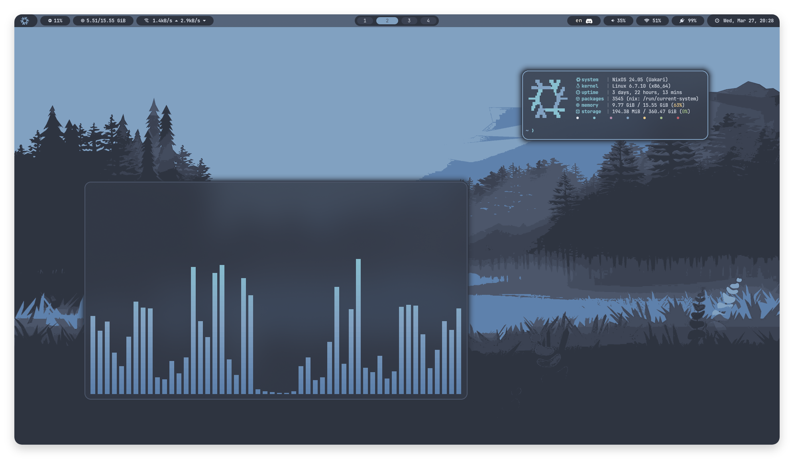
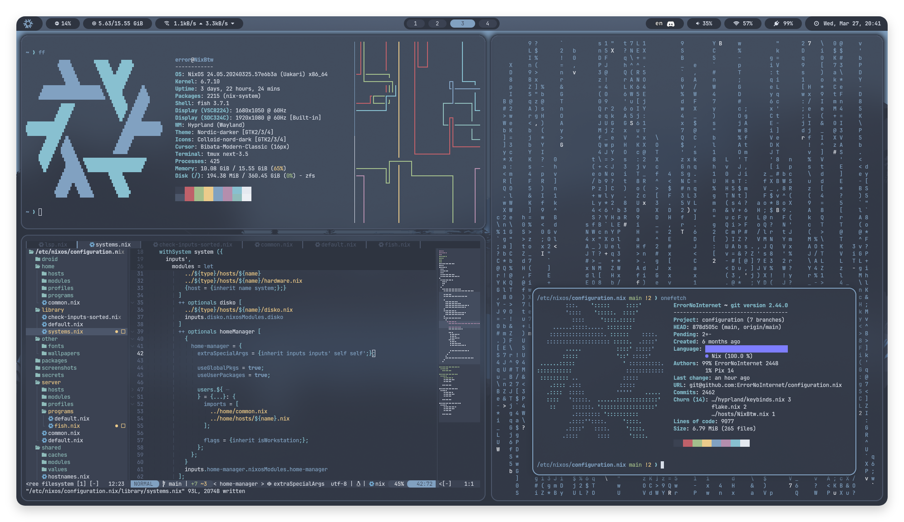

# ❄️ configuration.nix

Nix flake for my workstations, servers, home-manager configuration, and a lot more.

## 📁 Contents

- [droid](/droid): [nix-on-droid](https://github.com/nix-community/nix-on-droid) (termux, but Nix) configuration for my phone
- [home](/home): user dotfiles for my workstations, servers, and phone
- [library](/library): Nix helper functions (e.g. mkSystem and mkSpecialisation)
- [other](/other): other (configuration) files that don't fit in Nix expressions
- [packages](/packages): scripts and patched programs to make my life easier
- [server](/server): system configuration for some of my dedicated servers 
- [shared](/shared): shared modules (and binary caches) applied everywhere
- [shells](/shells): Nix development shells/environments (e.g. rust nightly)
- [workstation](/workstation): system configuration for my laptops and desktops

## 🖥️ Screenshots

## 💾 Inspiration

- https://github.com/fufexan/dotfiles
- https://github.com/Mic92/dotfiles
- https://github.com/workflow/dotfiles
