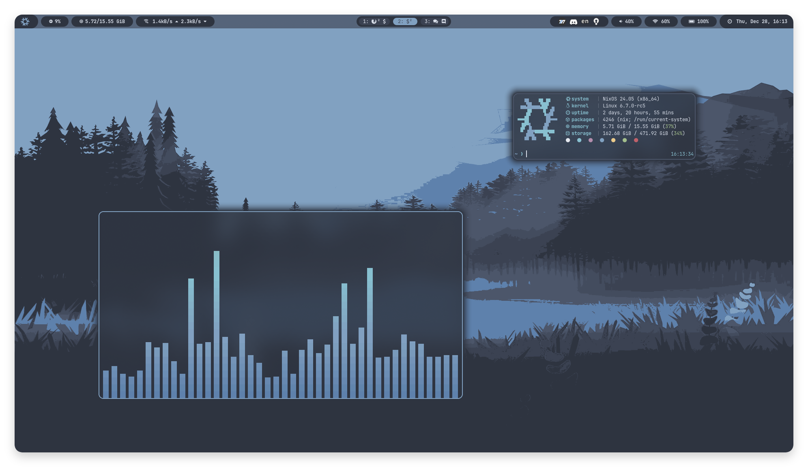

# ❄️ configuration.nix

Nix flake for my workstations, servers, home-manager configuration, and a lot more.

## 📁 Contents

- [shared](/shared): shared modules (and binary caches) applied everywhere
- [packages](/packages): some patches and bash scripts to make my life easier
- [workstations](/workstations): system configuration for my laptops and desktops
- [servers](/servers): system configuration for some of my dedicated servers 
- [home-manager](/home): user configuration for my workstations and servers
- [nix-on-droid](/droid): terminal configuration for my phone ([Nix-on-Droid](https://github.com/nix-community/nix-on-droid))
- [other](/other): other (configuration) files that don't fit in Nix expressions

## 🖥️ Screenshots

## 💾 Inspiration

- https://github.com/fufexan/dotfiles
- https://github.com/Mic92/dotfiles
- https://github.com/workflow/dotfiles
